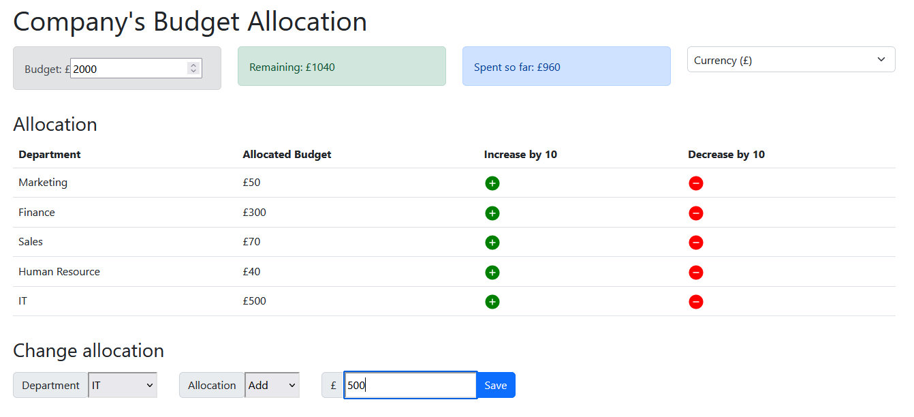

# Company's Budget Allocation App (React)

This project is a React application designed to help companies manage and allocate their budget across various departments.

## Features
Budget Setup: Define the total company budget for a specific period.

Department Allocation: Allocate the budget amongst different departments:
* Marketing
* Finance
* Sales
* HR
* IT

## Visualization:

Remaining Budget: View the remaining budget after allocations are made. This updates dynamically.

Spent Amount (Optional): Track actual spending within each department.

Modification Controls:
* Increase/Decrease Buttons: Each department section has buttons to increase or decrease their allocated budget by a 10 monetary unit.
* Currency Selection: Choose the currency unit displayed throughout the app (e.g., USD, EUR).

Technology Stack
* Frontend: React, bootstrap, and react-icons
* State Management: React Reducer and Context API (for managing budget, allocations, currency)
* Data Storage: Local storage
